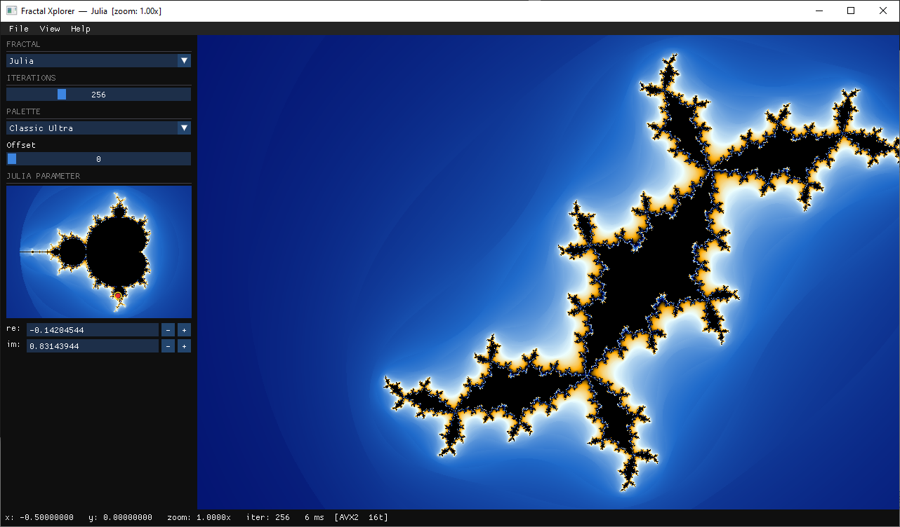

# Fractal Xplorer

A fast, no-nonsense fractal explorer for Windows.
Renders Mandelbrot, Julia, and Burning Ship fractals using AVX2-vectorised,
multithreaded arithmetic — no GPU required.



---

## Requirements

- Windows 10 or later (x86-64)
- OpenGL 3.3-capable GPU (any GPU from the last 15 years)
- No installation needed — extract the ZIP and run

---

## Running

Extract the ZIP anywhere and double-click **fractal_xplorer.exe**.

The app launches directly into a fully-rendered Mandelbrot set.
Exports are saved to the folder the exe is in.

---

## Navigation

| Action | Input |
|---|---|
| Zoom in / out | Mouse wheel |
| Pan | Left-click drag |
| Zoom to region | Right-click drag (rubber-band box) |
| Reset view | `R` key or **View → Reset View** |
| Zoom step in / out | `+` / `-` keys |

---

## Keyboard Shortcuts

| Key | Action |
|---|---|
| `R` | Reset view to default (centre/zoom only) |
| `+` / `-` | Zoom step in / out |
| `Ctrl+S` | Open export dialog |
| `F1` | About |

---

## Side Panel

**Fractal** — switch between Mandelbrot, Julia, and Burning Ship.

**Iterations** — logarithmic slider, 64 – 8192 (default 256).
Higher values reveal more detail at deep zoom at the cost of speed.

**Palette** — 8 predefined colour palettes:

| # | Name | Character |
|---|---|---|
| 0 | Grayscale | black → white |
| 1 | Fire | black → red → orange → yellow → white |
| 2 | Ice | black → blue → cyan → white |
| 3 | Electric | black → purple → blue → cyan → white |
| 4 | Sunset | black → deep-red → orange → pale-yellow |
| 5 | Forest | black → dark-green → lime → pale-green |
| 6 | Zebra | alternating black / white bands |
| 7 | Classic Ultra | blue-gold gradient (default) |

**Offset** slider — shifts the palette along the iteration axis (0 – 1023).

**Julia parameter** — click or drag on the mini Mandelbrot map to set the
complex parameter *c*. The main view switches to Julia automatically.
Fine-tune with the **re** / **im** numeric inputs.

---

## Export

Open with `Ctrl+S` or **File → Export Image**.

- **Format:** PNG (lossless) or JPEG XL (lossless, typically 2–3× smaller)
- **Resolution:** 1× / 2× / 4× current window size, or custom up to 7680 × 4320
- Filename is auto-generated: `mandelbrot_20260221_143012.png`

---

## Performance

Typical render times at 1080p, 256 iterations on a mid-range CPU:

| Path | Time |
|---|---|
| AVX2 + 16 threads | ~35–50 ms |
| Scalar + 16 threads | ~300–500 ms |

The status bar shows the last render time, active path, and thread count.

---

## Building from Source

**Prerequisites (MSYS2 / MinGW-w64):**

```bash
pacman -S mingw-w64-x86_64-gcc \
          mingw-w64-x86_64-cmake \
          mingw-w64-x86_64-SDL2 \
          mingw-w64-x86_64-libpng \
          mingw-w64-x86_64-libjxl \
          git
```

**Build:**

```bash
cmake -B build -G "MinGW Makefiles" -DCMAKE_PREFIX_PATH="/c/msys64/mingw64"
cmake --build build -- -j$(nproc)
```

**Package (produces `fractal_xplorer-1.0-win64.zip`):**

```bash
bash package.sh
```

---

## License

MIT — see [LICENSE](LICENSE).
